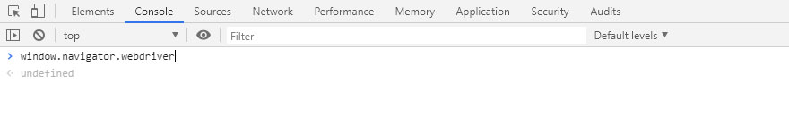
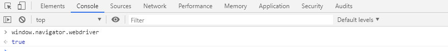

# 天猫爬虫
  
#### 天猫官网 - https://www.tmall.com/
|Author|Gobi Xu|
|---|---|
|Email|xusanity@aliyun.com|
****
## 声明
#### 任何内容都仅用于学习交流，请勿用于任何商业用途。
## 前言
#### 开始之前，你需要
- **下载chrome浏览器 :point_right:[地址在这](https://chrome.en.softonic.com/)**
- **下载chromedriver驱动 :point_right:[地址在这](http://chromedriver.storage.googleapis.com/index.html)**
## 运行环境
#### Version: Python3
## 安装依赖库
```
pip install selenium
pip install pyquery
```
## 介绍
- **防止被检测出为机器**
###### 一般我们在chrome浏览器的Console里输入window.navigator.webdriver后会返回undefined的值

###### 如果你在chromedriver驱动的Console里输入window.navigator.webdriver后会返回true的值

###### 解决办法
```
options = webdriver.ChromeOptions()
options.add_experimental_option('excludeSwitches', ['enable-automation'])  # 设置为开发者模式
# 在options里加上这个参数使得chromedriver驱动不会被检测出为机器
```
- **模仿人类行为**
###### 匀加速下滑浏览器
```
for i in range(1, 52):
  drop_down = "var q=document.documentElement.scrollTop=" + str(i*100)
  self.browser.execute_script(drop_down)
  time.sleep(0.01)  # 值越小越顺滑，越像人类行为
  # 模仿人类，发现喜欢的商品时会停止滑动
  if i == 5:
    time.sleep(1.3)
  if i == 15:
    time.sleep(1.9)
  if i == 29:
    time.sleep(0.7)
  if i == 44:
    time.sleep(0.3)
```
###### 匀加速右滑验证码的滑块（每次请求下一页商品列表页时可能会出现滑块验证码）
```
slider_button = WebDriverWait(self.browser, 5, 0.5).until(EC.presence_of_element_located((By.ID, 'nc_1_n1z')))
action = ActionChains(self.browser)
action.click_and_hold(slider_button).perform()
action.reset_actions()
# 模拟人类 向左拖动滑块（拖动有加速度）
for i in range(100):
  action.move_by_offset(i*1, 0).perform()
  time.sleep(0.01)  # 值越小越顺滑，越像人类行为
```
## 最后
#### 如有任何问题都可以邮箱:postbox:联系我，我会尽快回复你
