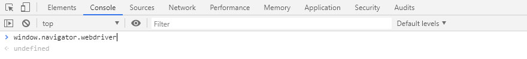

# 天猫爬虫
  
#### 天猫官网 - https://www.tmall.com/
|Author|Gobi Xu|
|---|---|
|Email|xusanity@aliyun.com|
****
## 声明
#### 任何内容都仅用于学习交流，请勿用于任何商业用途。
## 前言
#### 开始之前，你需要
- **下载chrome浏览器 :point_right:[地址在这](https://chrome.en.softonic.com/)**
- **下载chromedriver驱动 :point_right:[地址在这](http://chromedriver.storage.googleapis.com/index.html)**
## 运行环境
#### Version: Python3
## 安装依赖库
```
pip install selenium
pip install pyquery
```
## 介绍
- **防止被检测出为机器人**
#### 一般我们在chrome浏览器的Console里输入window.navigator.webdriver后会返回undefined的值

## 类目
#### :telephone_receiver:[手机](https://search.suning.com/%E6%89%8B%E6%9C%BA/)
#### 爬取字段：
- **商品id (id)**
- **商品标题 (title)**
- **商品价格 (price)**
- **商品牌子 (brand)**
- **商品型号 (model)**
- **商品的网店名称 (shop_name)**
- **商品评论数量 (comment_count)**
- **商品详情页网址 (url)**
